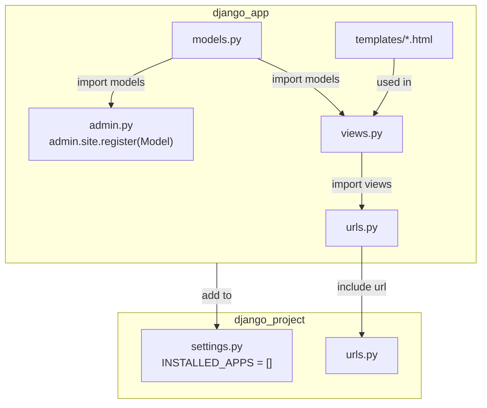
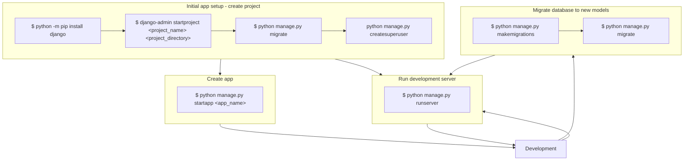

Ruffly following [DjangoX tutorial](https://learndjango.com/tutorials/django-blog-tutorial) | [GitHub](https://github.com/wsvincent/djangox)

## Project setup and initial stuff

### File structure "flow"

### Init, create, migrate, develop, run flow
